# Scoutlytics

**The first Answer Engine Optimization (AEO) tool that moves beyond diagnosis into execution.**

*AEO tools tell you what to fix. Scoutlytics fixes it.*

Built for the **DeveloperWeek 2026 Hackathon** -- powered by [You.com](https://you.com) APIs and [Foxit](https://developers.foxit.com) PDF Services.

**Live at:** [scoutlytics.xyz](https://scoutlytics.xyz)

---

## Table of Contents

- [The Problem](#the-problem)
- [The Solution](#the-solution)
- [Market Gap](#market-gap)
- [Features](#features)
- [Architecture](#architecture)
- [You.com API Integration](#youcom-api-integration)
- [Foxit API Integration](#foxit-api-integration)
- [Tech Stack](#tech-stack)
- [Getting Started](#getting-started)
- [Environment Variables](#environment-variables)
- [Project Structure](#project-structure)
- [How It Works](#how-it-works)
- [Scoring Methodology](#scoring-methodology)
- [Hackathon Sponsor Tracks](#hackathon-sponsor-tracks)
- [Architecture Diagrams](#architecture-diagrams)
- [License](#license)

---

## The Problem

AI search engines -- ChatGPT, Perplexity, Google AI Overviews, Claude, You.com -- now answer queries directly, citing specific web pages as sources. Traditional SEO no longer guarantees visibility. Brands need to appear in AI-generated answers, not just search result links. This is **Answer Engine Optimization (AEO)**.

The problem is not awareness. Brands know they need AEO. The problem is execution:

1. Existing AEO tools produce dashboards and recommendations.
2. Recommendations require human interpretation by an SEO strategist.
3. Strategy then requires a developer and content writer to implement changes.
4. Total cycle time from insight to live fix: **3 to 6 weeks minimum**.

Every existing tool in the market -- Profound, Scrunch AI, Peec AI, Omnia -- stops at "here is what is wrong." None of them produce the actual fixes.

## The Solution

Scoutlytics collapses the entire insight-to-implementation gap into a single automated pipeline. Input a domain and topic. Receive deployment-ready assets -- rewritten page copy, valid JSON-LD schema markup, structured content sections -- packaged into a professional PDF implementation brief.

**Total time: under 90 seconds.**

---

## Market Gap

| Capability | Existing AEO Tools | Scoutlytics |
|---|---|---|
| Monitors AI citations in real time | Partial (cached/indexed) | Yes (You.com live APIs) |
| Identifies why competitors are cited | Partial | Yes (pattern analysis engine) |
| Generates rewritten page copy | No | Yes |
| Produces ready-to-deploy JSON-LD schema | No | Yes |
| Delivers professional PDF implementation brief | No | Yes (Foxit PDF Services) |
| Works in under 90 seconds | No | Yes |

---

## Features

### 1. Domain Intelligence Intake

The analysis entry point. Users define their domain, target topic, and configuration.

- **Domain input** with real-time validation
- **Topic definition** in natural language (e.g., "vegan trail running shoes")
- **Competitor benchmarking** -- enter up to 3 competitor domains or let Scoutlytics auto-detect from You.com results
- **Analysis configuration** -- depth setting (Quick/Standard/Deep), output format (PDF/JSON/Both), geographic targeting
- **Interactive demo** -- a pre-loaded nike.com sample analysis is visible on the landing page before the user submits anything; toggling "Try Your Own Domain" switches to live mode

### 2. You.com Live Intelligence Layer

The core data pipeline. All citation intelligence is gathered live through You.com APIs.

- **Citation Discovery** -- queries You.com Search API with 5 query variants (exact topic, question form, comparison form, "best" form, "how to" form) to find which URLs AI engines are currently citing
- **Live Page Content Extraction** -- for each cited URL, uses You.com Search API with `livecrawl` mode to fetch full page content in real time, not from a cache
- **Domain Analysis** -- simultaneously extracts and analyzes the user's own page to establish a baseline (existing schema, heading structure, FAQ presence, content depth)
- **Advanced Multi-Step Research** -- the You.com Advanced Agent API runs iterative deep research for complex topics, streaming results with high search effort and report verbosity

### 3. Pattern Analysis Engine

A custom TypeScript engine that reverse-engineers why certain pages get cited by AI.

- **Structural Signal Analysis** -- scores schema markup completeness, heading hierarchy (H1/H2/H3 distribution), FAQ detection, content depth, entity density
- **Citation Pattern Clustering** -- clusters top-cited pages into 2-3 dominant "citation archetypes" (Authority Hub, FAQ-Rich, Deep Comparison) and scores each by citation frequency
- **Gap Differential Analysis** -- produces a ranked list of gaps between the user's page and the winning archetype, ordered by citation impact score (e.g., "Missing FAQ schema: +0.35 citation probability")
- **Citation Probability Score** -- a 0-100 score based on schema presence, FAQ coverage, content depth, heading quality, entity mentions, and current citation status. Projects the score after implementing each recommended fix.

### 4. Asset Generation Engine

Scoutlytics generates deployment-ready assets, not recommendations.

- **Rewritten Page Copy** -- generates a full rewrite structured to match the winning citation archetype, delivered in markdown ready to paste into any CMS
- **JSON-LD Schema Generation** -- produces complete, valid JSON-LD markup for recommended schema types (Article, FAQPage, Product, HowTo, BreadcrumbList), pre-populated with the user's actual data
- **Content Section Generation** -- generates specific missing content sections (FAQ with 20+ Q&A pairs, comparison tables, how-to guides) as standalone HTML and markdown
- **Internal Link Recommendations** -- identifies internal linking patterns from top-cited pages and generates a recommended link structure

### 5. Foxit Implementation Brief

All generated assets are packaged into a professional, shareable PDF document.

- **HTML-to-PDF conversion** via Foxit PDF Services API -- the analysis results are rendered into a self-contained HTML template, uploaded to Foxit, and converted into a polished PDF
- **Structured brief sections** -- Cover Page, Table of Contents, Executive Summary, Citation Probability Score card, Citation Analysis, Gap Report with impact scores, Schema Markup code blocks, Rewritten Copy, Content Sections, Internal Link Recommendations, Advanced Research findings, API Methodology transparency section, Implementation Checklist
- **Three-strategy fallback** -- if Foxit PDF Services is unavailable, falls back to Foxit Document Generation API, then to a DOCX file generated locally via the `docx` library
- **Page count estimate** displayed on the brief page before download
- **PDF download and HTML preview** available from the brief page

### 6. Dashboard and History

Persistent analysis history powered by Supabase.

- **Analysis history table** showing all past analyses with domain, topic, date, score, and download links
- **Re-run analysis** -- a re-run button on each completed job triggers a fresh analysis with current live data
- **Score trends** -- when re-running, shows the delta between previous and current scores

### 7. Competitor Benchmarking Charts

Visual competitive intelligence rendered directly in the results page.

- **Before/After score projections** with improvement deltas
- **Citation archetype distribution** showing which structural patterns dominate the topic
- **Gap impact visualization** ranking all identified gaps by citation probability impact

---

## Architecture

Scoutlytics runs as a Next.js application with a 5-stage asynchronous pipeline. Each stage is a discrete API route designed to complete within Vercel's 10-second serverless function timeout.

```
Client (Loading Page)
  |
  |-- POST /api/analyze              --> Create job, persist to Supabase
  |-- POST /api/analyze/:id/discover --> You.com Search API (5 query variants)
  |-- POST /api/analyze/:id/extract  --> You.com Search API (livecrawl) x N pages
  |-- POST /api/analyze/:id/patterns --> Local TypeScript analysis engine
  |-- POST /api/analyze/:id/generate --> You.com Express Agent API x 1-3 prompts
  |-- POST /api/analyze/:id/pdf      --> Foxit PDF Services (upload -> convert -> download)
```

The client orchestrates all 5 stages sequentially from the loading page. Between each stage, it polls `GET /api/analyze/:id` to update the progress UI with live preview data.

**Persistence:** Hybrid model -- in-memory `Map<string, AnalysisJob>` for fast access during analysis, with Supabase as the durable backing store for dashboard history and cross-session retrieval.

---

## You.com API Integration

Scoutlytics uses **four distinct You.com API capabilities** across multiple pipeline stages:

### Search API (Citation Discovery)

```
GET https://ydc-index.io/v1/search
Headers: X-API-Key: <key>
Params: query, count, country
```

Called with **5 query variants** per analysis to capture diverse citation patterns. Results are deduplicated by URL and ranked by citation frequency across all variants. This is how Scoutlytics discovers which pages AI engines treat as authoritative for a given topic.

### Search API with Livecrawl (Content Extraction)

```
GET https://ydc-index.io/v1/search
Headers: X-API-Key: <key>
Params: query=site:<url>, livecrawl=web, livecrawl_formats=markdown
```

For each cited URL, Scoutlytics fetches full live page content in real time. This is not cached or indexed data -- judges can verify the extraction is live. The markdown output is parsed for heading structure, word count, FAQ sections, entity mentions, and internal links.

### Express Agent API (Content Generation)

```
POST https://api.you.com/v1/agents/runs
Headers: Authorization: Bearer <key>
Body: { agent: "express", input: "<prompt>", stream: false }
```

Generates deployment-ready assets: rewritten page copy structured to match the winning citation archetype, FAQ sections with question-answer pairs, and JSON-LD schema markup. Called 1-3 times per analysis depending on which gaps are identified.

### Advanced Agent API (Deep Research)

```
POST https://api.you.com/v1/agents/runs
Headers: Authorization: Bearer <key>, Accept: text/event-stream
Body: { agent: "advanced", input: "<prompt>", stream: true,
        tools: [{ type: "research", search_effort: "high", report_verbosity: "high" }] }
```

For complex or ambiguous topics, runs iterative multi-step research with streaming Server-Sent Events. Surfaces subtopic coverage, knowledge gaps, and content opportunities that inform the gap analysis.

---

## Foxit API Integration

Scoutlytics uses **two Foxit API services** for document generation:

### PDF Services API (Primary)

```
Base: https://na1.fusion.foxit.com
Auth: client_id + client_secret + Authorization: Basic Og==
```

The primary PDF pipeline:
1. **Upload** -- `POST /pdf-services/api/documents/upload` with the HTML brief as a file
2. **Convert** -- `POST /pdf-services/api/documents/{id}/to/pdf` to convert HTML to PDF
3. **Poll** -- `GET /pdf-services/api/tasks/{taskId}` until conversion completes
4. **Download** -- `GET /pdf-services/api/documents/{id}/download` to retrieve the final PDF binary

The HTML template is a self-contained document with inline CSS, structured sections, page break hints, and print-optimized styling that produces a professional multi-page brief.

### Document Generation API (Fallback)

```
POST /docgen-services/api/documents/generate
Body: { template, documentValues, outputFormat: "pdf" }
```

Template-driven generation used as a fallback if the PDF Services pipeline is unavailable. Populates a brief template with dynamic analysis data.

### DOCX Fallback

If both Foxit services are unavailable, Scoutlytics generates a DOCX file locally using the `docx` library, ensuring users always receive a downloadable deliverable.

---

## Tech Stack

| Layer | Technology | Version |
|---|---|---|
| Framework | Next.js (App Router, Turbopack) | 16.1.6 |
| UI | React | 19.2.3 |
| Language | TypeScript (strict mode) | 5.x |
| Styling | Tailwind CSS | 3.4.17 |
| Icons | lucide-react | 0.575.0 |
| Persistence | Supabase | 2.97.0 |
| Documents | docx (DOCX fallback) | 9.5.3 |
| Search + AI | You.com Search, Express Agent, Advanced Agent | -- |
| PDF | Foxit PDF Services, Document Generation | -- |
| Deployment | Vercel (serverless, 10s timeout) | -- |

---

## Getting Started

### Prerequisites

- Node.js 18 or later
- npm, yarn, or pnpm
- API keys for You.com, Foxit, and Supabase (see [Environment Variables](#environment-variables))

### Installation

```bash
git clone https://github.com/AryanSaxenaa/Scoutlytics.git
cd Scoutlytics/citefix-web
npm install
```

### Configuration

Create a `.env.local` file in the `citefix-web/` directory:

```env
YOU_API_KEY=your_youcom_api_key

FOXIT_CLIENT_ID=your_foxit_pdf_services_client_id
FOXIT_CLIENT_SECRET=your_foxit_pdf_services_client_secret
FOXIT_DOCGEN_CLIENT_ID=your_foxit_docgen_client_id
FOXIT_DOCGEN_CLIENT_SECRET=your_foxit_docgen_client_secret

NEXT_PUBLIC_SUPABASE_URL=your_supabase_project_url
NEXT_PUBLIC_SUPABASE_PUBLISHABLE_DEFAULT_KEY=your_supabase_anon_key
```

### Run

```bash
npm run dev
```

Open [http://localhost:3000](http://localhost:3000) to access Scoutlytics.

### Build

```bash
npm run build
npm start
```

---

## Environment Variables

| Variable | Required | Purpose |
|---|---|---|
| `YOU_API_KEY` | Yes | You.com Search API + Agent APIs |
| `FOXIT_CLIENT_ID` | Yes | Foxit PDF Services authentication |
| `FOXIT_CLIENT_SECRET` | Yes | Foxit PDF Services authentication |
| `FOXIT_DOCGEN_CLIENT_ID` | Yes | Foxit Document Generation API authentication |
| `FOXIT_DOCGEN_CLIENT_SECRET` | Yes | Foxit Document Generation API authentication |
| `NEXT_PUBLIC_SUPABASE_URL` | Yes | Supabase project URL for persistence |
| `NEXT_PUBLIC_SUPABASE_PUBLISHABLE_DEFAULT_KEY` | Yes | Supabase anonymous/public key |

---

## Project Structure

```
citefix-web/
├── app/
│   ├── globals.css                    # Global styles, CSS variables, custom utilities
│   ├── layout.tsx                     # Root layout with font configuration
│   ├── page.tsx                       # Landing page (hero, features, demo, pricing)
│   ├── InteractiveDemo.tsx            # Pre-loaded sample + live analysis toggle
│   ├── analyze/
│   │   ├── page.tsx                   # Analysis input form with configuration
│   │   └── [jobId]/
│   │       ├── loading/page.tsx       # 5-stage progress visualization with live preview
│   │       ├── results/page.tsx       # Full results dashboard with charts
│   │       └── brief/page.tsx         # PDF preview + download + page estimate
│   ├── dashboard/page.tsx             # Analysis history, re-run, score trends
│   └── api/
│       └── analyze/
│           ├── route.ts               # POST: create analysis job
│           └── [jobId]/
│               ├── route.ts           # GET: job status polling
│               ├── discover/route.ts  # Stage 1: citation discovery
│               ├── extract/route.ts   # Stage 2: content extraction
│               ├── patterns/route.ts  # Stage 3: pattern analysis
│               ├── generate/route.ts  # Stage 4: asset generation
│               └── pdf/
│                   ├── route.ts       # Stage 5: PDF generation
│                   └── download/route.ts  # PDF/HTML download endpoint
├── lib/
│   ├── types.ts                       # All TypeScript interfaces
│   ├── store.ts                       # Supabase + memory cache hybrid store
│   ├── youcom.ts                      # You.com API client (Search, Express, Advanced)
│   ├── foxit.ts                       # Foxit API client (PDF Services, DocGen)
│   ├── analysis.ts                    # Citation pattern analysis engine
│   ├── brief-template.ts             # HTML brief template generator
│   └── docx-generator.ts             # DOCX fallback generator
└── public/
    └── logo.png                       # Scoutlytics logo
```

---

## How It Works

### End-to-End Flow

1. **User enters a domain and topic** on the analysis page (e.g., `nike.com` and `vegan trail running shoes`).

2. **Stage 1 -- Discovery.** Scoutlytics queries the You.com Search API with 5 query variants to find which URLs AI engines are currently citing for this topic. Results are deduplicated and ranked by citation frequency.

3. **Stage 2 -- Extraction.** For each top-cited URL and the user's own domain, Scoutlytics calls You.com Search API with `livecrawl` to fetch full page content in real time. Each page is parsed for heading structure, word count, FAQ sections, schema markup, internal links, and entity mentions.

4. **Stage 3 -- Pattern Analysis.** The local TypeScript engine clusters cited pages into structural archetypes, identifies the dominant citation pattern, and produces a ranked gap list comparing the user's page against the winning archetype. A Citation Probability Score (0-100) is calculated.

5. **Stage 4 -- Asset Generation.** Based on identified gaps, Scoutlytics calls the You.com Express Agent API to generate deployment-ready fixes: rewritten page copy, JSON-LD schema markup, FAQ sections, and content blocks. Only the assets corresponding to actual gaps are generated.

6. **Stage 5 -- PDF Brief.** All analysis data and generated assets are rendered into a structured HTML template and uploaded to Foxit PDF Services for conversion into a professional multi-page PDF. The brief includes an executive summary, score visualizations, gap rankings, all generated code and content, and an implementation checklist.

7. **User downloads the PDF** from the brief page, or views the full results on the interactive results dashboard.

---

## Scoring Methodology

### Citation Probability Score (0-100)

The score quantifies how likely a page is to be cited by AI search engines, based on structural and content signals:

| Signal | Points |
|---|---|
| Base | 10 |
| Domain found in current AI citations | +30 |
| Schema markup present | +15 |
| FAQ section present | +12 |
| Content depth (scaled) | up to +15 |
| Heading structure quality (scaled) | up to +12 |
| Entity mention density (> 5 entities) | +6 |
| **Maximum** | **100** |

### Projected Score

For each identified gap, an impact score (0-1) estimates the citation probability improvement if that gap is addressed. The projected score sums all gap impacts and caps at 95.

### Content Depth Score (0-100)

Evaluates page substance: word count thresholds (500/1000/2000), FAQ presence, entity density, schema presence, and heading count. Used as an input to the Citation Probability Score.

### Heading Score (0-100)

Evaluates heading hierarchy quality: single H1 (+30), H2 frequency (up to +40), H3 frequency (up to +20), and multi-level hierarchy bonus (+10).

---

## Hackathon Sponsor Tracks

**How Scoutlytics Uses You.com APIs:**

Scoutlytics is built on top of four You.com API capabilities, each serving a distinct and necessary role in the pipeline:

- **Search API** is called with 5 query variants per analysis for citation discovery. It determines which pages AI engines currently treat as authoritative. Without this, there is no ground-truth data for the entire analysis.
- **Search API (livecrawl mode)** extracts full live page content for every cited URL plus the user's domain. This is real-time content, not cached snapshots. The structural signals parsed from these pages (headings, FAQ sections, word count, entity mentions, internal links) are the inputs to the pattern analysis engine.
- **Express Agent API** generates the actual deployment-ready assets: rewritten copy, JSON-LD schema, FAQ sections, and content blocks. The prompts are constructed dynamically based on the specific gaps identified in Stage 3, so the agent output is tailored to each analysis.
- **Advanced Agent API** performs deep iterative research with streaming, surfacing subtopic coverage and knowledge gaps that cannot be discovered through simple search queries.

The You.com integration is not cosmetic. Remove any one of these four capabilities and the pipeline breaks. Citation discovery fails without Search. Gap detection fails without livecrawl content extraction. Asset generation fails without Express Agent. Deep research fails without Advanced Agent.


**How Scoutlytics Uses Foxit APIs:**

The PDF implementation brief is not a feature bolted onto the side of Scoutlytics. It is the product. The entire pipeline exists to produce this deliverable -- a professional, structured document that goes from analyst to developer to content team.

- **PDF Services API** is the primary output pipeline. The analysis brief is rendered as self-contained HTML with inline CSS, uploaded to Foxit, converted to PDF, polled for completion, and downloaded. The HTML template includes structured sections with page break hints, print-optimized styling, code blocks with syntax highlighting, before/after comparison boxes, and a branded cover page.
- **Document Generation API** serves as a template-driven fallback for PDF generation, populating a pre-built brief structure with dynamic analysis data.
- **Three-strategy resilience.** If PDF Services returns an error, Scoutlytics falls back to Document Generation. If both fail, it generates a DOCX file locally. The user always receives a downloadable document.

The workflow design reflects how AEO deliverables are actually used in industry: they are handed off as documents. Foxit makes that handoff professional and distribution-ready.

---

## Architecture Diagrams


### Pipeline Architecture


### System Architecture

```mermaid
flowchart LR
    subgraph "Client - Next.js App"
        LP[Landing Page]
        AN[Analyze Page]
        LD[Loading Page]
        RS[Results Page]
        BR[Brief Page]
        DB[Dashboard]
    end

    subgraph "API Routes - Next.js Serverless"
        R1[POST /api/analyze]
        R2[POST .../discover]
        R3[POST .../extract]
        R4[POST .../patterns]
        R5[POST .../generate]
        R6[POST .../pdf]
        R7[GET .../download]
    end

    subgraph "External APIs"
        YS[You.com Search API]
        YE[You.com Express Agent]
        YA[You.com Advanced Agent]
        FP[Foxit PDF Services]
        FD[Foxit Document Generation]
    end

    subgraph "Data Layer"
        MC[Memory Cache]
        SB[Supabase]
    end

    AN --> R1
    LD --> R2 & R3 & R4 & R5 & R6
    BR --> R7

    R2 --> YS
    R3 --> YS
    R4 --> MC
    R5 --> YE
    R5 --> YA
    R6 --> FP
    R6 -.-> FD

    R1 & R2 & R3 & R4 & R5 & R6 --> MC & SB
    DB --> SB
```



### Data Flow


---

## License
This project is licensed under the [MIT License](LICENSE).

You are free to use, modify, and distribute this software, provided that the original copyright notice and permission notice are included in all copies or substantial portions of the Software.

Copyright (c) 2026 Aryan Saxena
All rights reserved.
